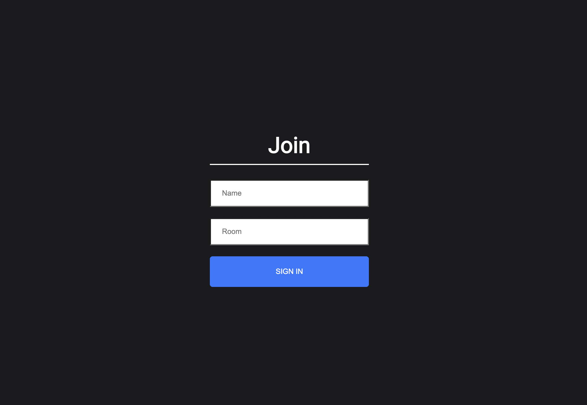
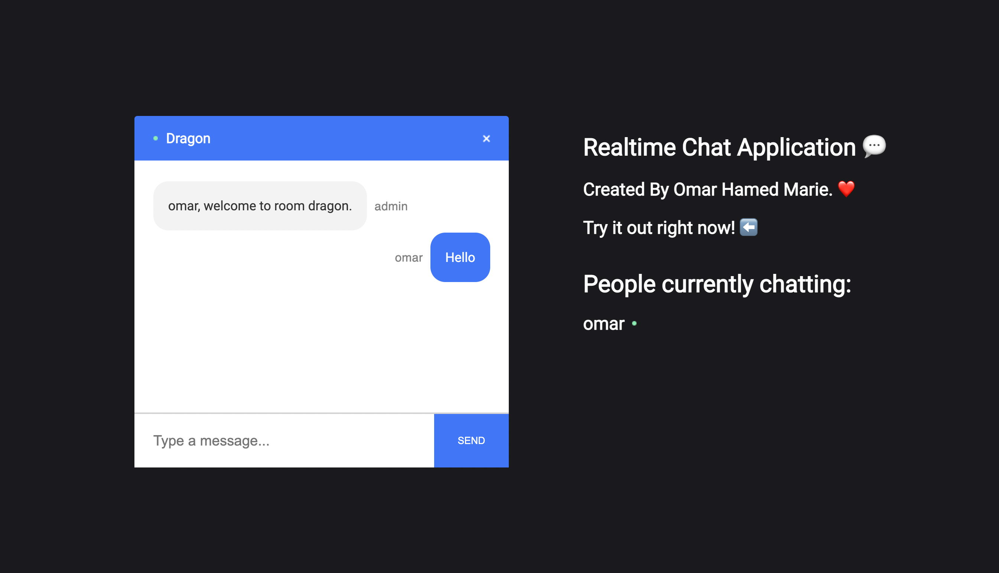

## 🤔 Installing and Running the project

To install the project you just need to `clone` it then:
> 1. cd server and run `npm start`
> 2. cd client and run `npm start` 

 

Note that:
* Kindly make sure you have `node` installed on your machine

 

### 💬 Chat App

Real time chat application using javascript, socket.io reactjs and nodejs. 

 

### 📸 Wireframe
 

 

 